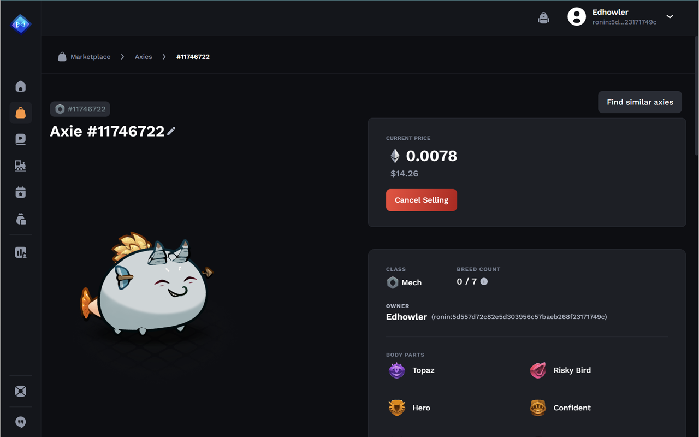

# Find Similar Axies Chrome Extension

This is a Google Chrome extension that adds a link on axies pages in the marketplace. The link leads to a search for similar axies in the marketplace.

## How to manually install

1. Open Chrome and go to the extensions page (chrome://extensions/)
1. Enable "Developer mode" (usually a switch in the upper right corner)
1. Click "Load unpacked" (usually a button in the upper left corner)
1. Select your extension's directory (/my_extension)

## Screenshot

